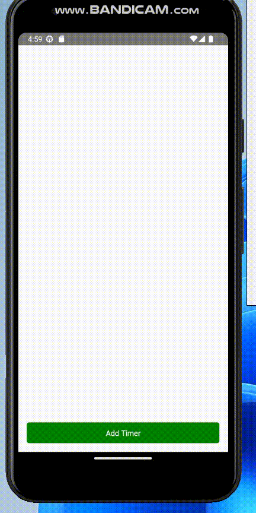

# Countdown Timer List with Start, Pause, and Resume Buttons

This project implements a countdown timer list using React Native. The list allows users to add multiple timers, each with its own state and functionality to start, pause, and resume the countdown. The timers can be customized with user-inputted durations in seconds.

## Features

- Add multiple timers to the list
- Each timer displays the remaining time in HH:mm:ss format
- Start button to initiate the countdown
- Pause button to pause the countdown
- Resume button to resume a paused countdown
- The list maintains the state of each timer even when paused or resumed



## Getting Started

### Prerequisites

Make sure you have the following installed:

- Node.js
- React Native CLI
- Android Studio (for Android development) or Xcode (for iOS development)

### Installation

1. Clone the repository:

   ```shell
   git clone <repository-url>

## Navigate to the project directory: `cd countdown-timer-list`

## Install the dependencies: `npm install`

## Running the Application
 - Android
 - Start an Android emulator or connect an Android device to your computer.

  - Run the following command to start the app: `npx react-native run-android`

- iOS
  - Start an iOS simulator or connect an iOS device to your computer.

  - Run the following command to start the app: `npx react-native run-ios`


## Usage

1. Launch the countdown timer list app on your device or emulator.

2. Tap the "Add Timer" button to add a new timer to the list.

3. In the new timer row, enter the desired duration in seconds using the provided text input.

4. Tap the "Start" button to start the countdown for that timer.

5. To pause the countdown, tap the "Pause" button.

6. To resume a paused countdown, tap the "Resume" button.

7. Repeat steps 3-6 for additional timers as needed.